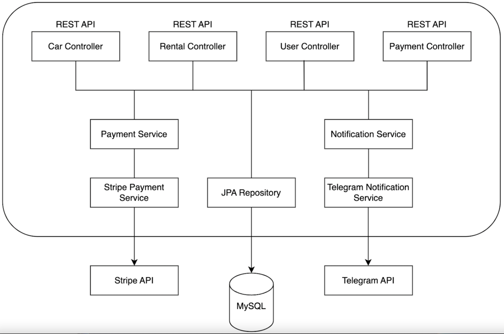
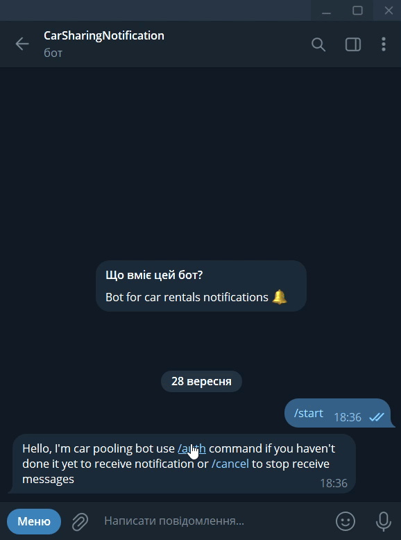
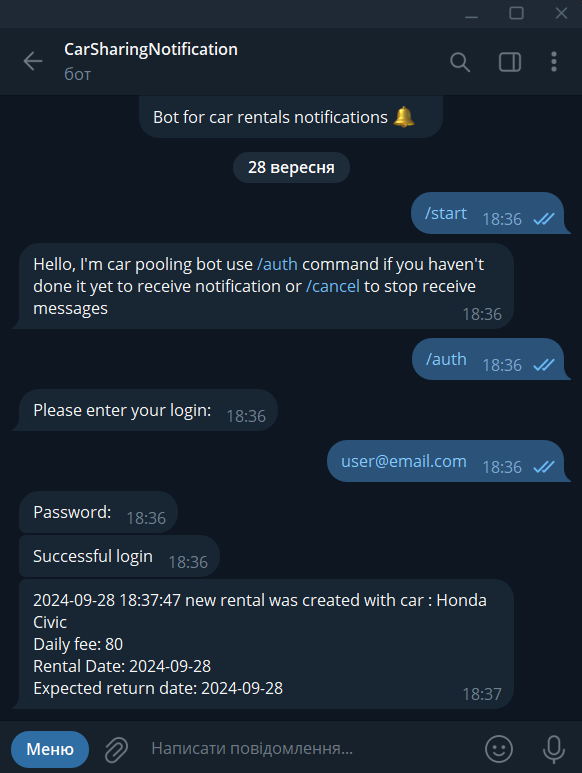
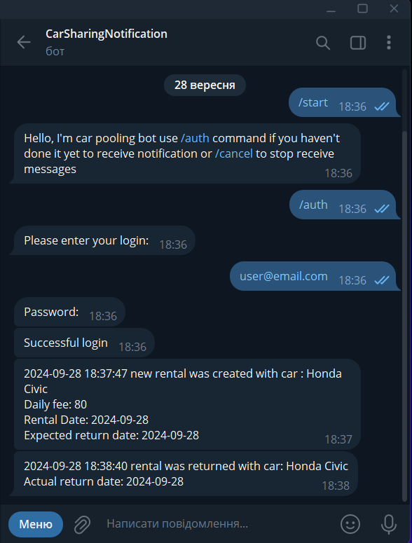
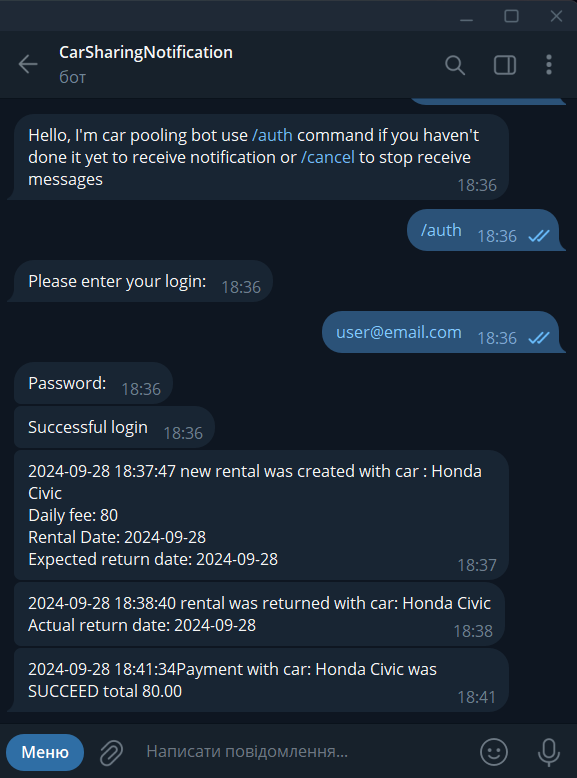
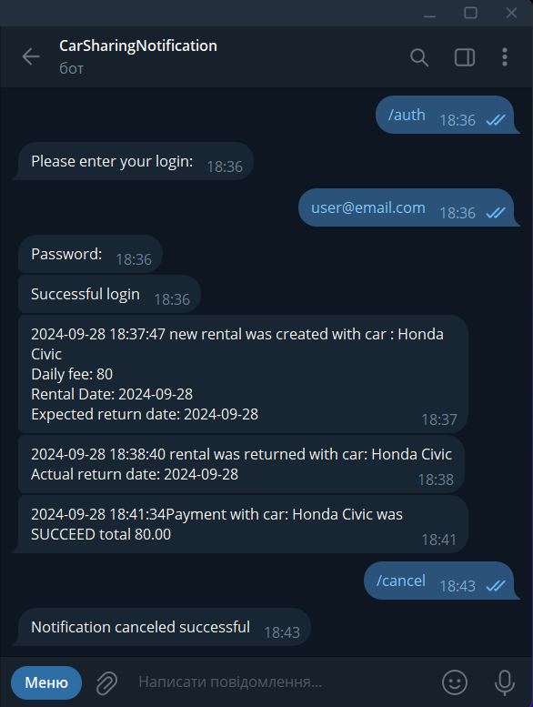

# Car Sharing Service

## Project Overview

The Car Sharing Service project is designed to revolutionize the existing, outdated paper-based car rental system. By creating an efficient, online platform for car rentals, this project improves the overall experience for both users and administrators. With support for online payments, real-time car availability, and rental tracking, the system resolves major pain points in traditional car rental services.

Our solution addresses the following key issues:
- Manual tracking of cars, users, and rentals on paper.
- No real-time view of car availability.
- Cash-only payments, with no option for credit cards or online transactions.
- Lack of a system to manage late returns and fines.

The result is a modern, efficient service that empowers administrators and enhances the user experience.

---

## Project Highlights

This project stands out by providing:
- **Full Automation**: From booking a car to processing payments and fines, everything is automated.
- **User-Centric Interface**: Both customers and managers have distinct, easy-to-use interfaces tailored to their specific roles.
- **Real-Time Updates**: Car inventory and rental availability are always up-to-date.
- **Modern Payment Integration**: Support for credit card payments through Stripe ensures secure and convenient transactions.
- **Scalable Solution**: The system can easily scale to accommodate growing inventory and user bases.

---

## Setup Instructions

1. 🚀 Install [Docker](https://www.docker.com/products/docker-desktop/)
2. 📦 Clone [THIS](https://github.com/Stipaxa-hub/car-sharing-app.git) repository
3. 🔧 Configure a "**.env**" file with necessary environment variables
4. 🛠️ Run the command `mvn clean package`
5. 🚢 Use `docker-compose up --build` to build and launch Docker containers
6. 🌐 Access the locally running application at `http://localhost:8088`

---

## Key Features

### 1. **Seamless User Experience**
Customers can register, browse available cars, book rentals, and pay online using an intuitive interface. Administrators manage the fleet, users, rentals, and payments, all from a single dashboard.

### 2. **Real-Time Car Availability**
With a live inventory management system, users can see which cars are available for rent in real-time, preventing double bookings and ensuring transparency.

### 3. **Automated Payment and Fine System**
The platform integrates with Stripe for online payments, supporting both credit cards and other payment methods. Fines for late car returns are automatically calculated and processed, eliminating the need for manual intervention.

### 4. **Role-Based Access**
Two types of users:
- **Customers**: Can browse, rent cars, and manage their profile.
- **Managers**: Oversee car listings, rental transactions, user roles, and payment processing.

### 5. **Notifications and Alerts**
Administrators are automatically notified of critical events such as new bookings, overdue returns, and successful payments through the integrated Telegram notification system. This ensures immediate action on overdue rentals and other important events.

### 6. **Rental Management**
Track and manage all active and past rentals with ease. The system provides detailed information on rental duration, car condition, return status, and overdue fines.

---

## Technology Stack

  
<b>Spring Boot</b>

*A framework for building and deploying Java applications with an embedded server, simplifying configuration and accelerating development.*

  
<b>Spring Data JPA</b>

*Part of the Spring Data project, providing an abstraction for working with databases through JPA (Java Persistence API), simplifying interaction with relational databases.*

  
<b>Spring MVC</b>

*Model-View-Controller framework for developing web applications, enabling easy creation of websites and web services.*

  
<b>Spring Security</b>

*Framework for securing Spring applications, adding authentication and authorization to protect resources.*

  
<b>Docker</b>

*Platform for automating deployment and managing containerized applications, simplifying work with isolated environments.*

  
<b>JUnit</b>

*A popular testing framework for Java that provides annotations to identify test methods, assertions for testing expected results, and test runners for executing test cases.*

  
<b>Liquibase</b>

*Tool for version control of database schemas, allowing controlled schema changes.*

  
<b>Lombok</b>

*Library that automates code generation to reduce boilerplate cLombok: ode, such as getters, setters, and equals/hashCode.Lombok: ode, such as getters, setters, and equals/hashCode.*

  
<b>Mapstruct </b>

*Library for automatic code generation of mappings between Java objects, simplifying conversion between different models.*

  
<b>Maven</b>

*Tool for managing project dependencies, compilation, building, and publishing of Java programs.*

  
<b>Mockito</b>

*A mocking framework for Java that allows the creation of mock objects in automated tests, facilitating the isolation of code units for more effective testing.*

  
<b>MySQL</b>

*Relational database that uses the SQL language for managing and interacting with data.*

  
<b>Stripe API</b>

*A set of tools and APIs for building online payment solutions, allowing developers to integrate payment processing into their applications.*

  
<b>Swagger</b>

*Tool for automatically generating API documentation, allowing developers to interactively engage with and understand the structure of the API.*

  
<b>Telegram API</b>

*A set of APIs provided by Telegram Messenger for building chatbots, integrations, and other applications on the Telegram platform.*

---

## Project Structure

## Endpoints

📝 **Authentication Controller**

| HTTP Method | Endpoint           | Description                       |
|:-----------:|:------------------:|:---------------------------------:|
|    POST     | `/auth/register`   | Register a new user.              |
|    POST     | `/auth/login`      | Login and get JWT tokens.         |

🔐 **Users Controller**

| HTTP Method | Endpoint                 | Description                               |
|:-----------:|:------------------------:|:-----------------------------------------:|
|    GET      | `/users/me`              | Get my profile info.                      |
|    PUT      | `/users/me`              | Update my profile.                        |
|    PUT      | `/users/{id}/role`       | Update user role (Manager/Customer).      |

🚗 **Cars Controller**

| HTTP Method | Endpoint                 | Description                               |
|:-----------:|:------------------------:|:-----------------------------------------:|
|    POST     | `/cars`                  | Add a new car to the inventory.           |
|    GET      | `/cars`                  | Get a list of all cars.                   |
|    GET      | `/cars/{id}`             | Get detailed information about a car.     |
|    PUT      | `/cars/{id}`             | Update car details (e.g., inventory).     |
|   DELETE    | `/cars/{id}`             | Delete a car from the inventory.          |

📅 **Rentals Controller**

| HTTP Method | Endpoint                             | Description                                           |
|:-----------:|:------------------------------------:|:-----------------------------------------------------:|
|    POST     | `/rentals`                           | Add a new rental (reduces car inventory by 1).        |
|    GET      | `/rentals/?user_id=...&is_active=...`| Get rentals filtered by user ID and active status.    |
|    GET      | `/rentals/{id}`                      | Get specific rental details.                          |
|    PATCH    | `/rentals/{id}/return`               | Set the actual return date (increases car inventory). |

💳 **Payments Controller**

| HTTP Method | Endpoint                           | Description                                           |
|:-----------:|:----------------------------------:|:-----------------------------------------------------:|
|    POST     | `/payments`                        | Create a new payment session.                         |
|    GET      | `/payments/?user_id=...`           | Get payments filtered by user ID.                     |
|    GET      | `/payments/success`                | Redirect for successful Stripe payments.              |
|    GET      | `/payments/cancel`                 | Handle canceled Stripe payments.                      |

📱 **Notifications (Telegram)**

- **Notifications**: Instant alerts for new rentals, overdue rentals, and payment success through Telegram Bots.

---

## Visual Demonstrations

Here are some visuals demonstrating the functionality of the Car Sharing Service:

1. **Telegram Notification:**
      
      
      
      
      
3. **Payment**
   
   

---

## Author
- 👨‍💻[Stepan Petriv](https://github.com/Stipaxa-hub)